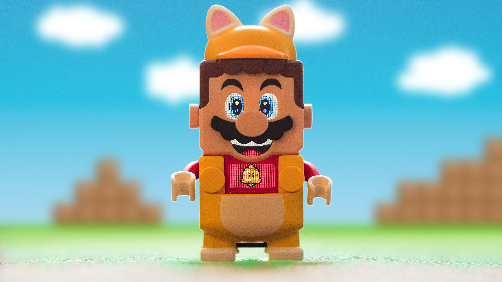

# MarioBot (Discord Bot)
> MarioBot is a mutipurpose Discord Bot built with [discord.py](https://github.com/Rapptz/discord.py)

## 📑 Requirements

1. Docker
2. A Discord Bot Token [Guide](https://discordjs.guide/preparations/setting-up-a-bot-application.html#creating-your-bot)

## 🚀 Getting Started

```sh
git clone https://github.com/mariogarridopt/mariobot.git
cd mariobot
```

Set up discord token
```sh
cp .env.example .env
# edit .env file
```

Start the bot
```sh
docker compose up -d
```

## ⚙️ Configuration

⚠️ Please keep in mind that you should never commit or publicly distribute your token or API keys.⚠️

We have the file `.env` and all the configs should be there and never pushed.
```sh
BOT_TOKEN="XXXXXXXXXXXXXXXXXXXXXXXX.XXXXXX.XXXXXXXXXXXXXXXXXXXXXXXXXXX"
OPENAI_API_KEY="sk-XXXXXXXXXXXXXXXXXXXXXXXXXXXXXXXXXXXXXXXXXXXXXXXX"
```

## 🗨 Features & Commands

Rolls (commands)
- [X] **`roll`**
- [X] **`valorantroll`**
- [X] **`leagueroll`**

Roles (feature)
- [X] **`add role on react to message`**
- [X] **`remove role on react to message`**

Time (feature)
- [X] **`display current time on discord`**

AI (feature)
- [X] **`chat with the bot on bot channel`**
- [X] **`Command /ai`**

## 🤝 Contributing

Contributions are what make the open source community such an amazing place to be learn, 
inspire, and create. Any contributions you make are **greatly appreciated**.

1. [Fork the repository](https://github.com/mariogarridopt/mariobot/fork)
2. Clone your fork `git clone https://github.com/<youruser>/mariobot.git`
3. Create your feature branch `git checkout -b AmazingFeature`
4. Stage changes `git add .`
5. Commit your changes `git commit -m 'Added some AmazingFeature'`
6. Push to the branch `git push origin AmazingFeature`
7. Submit a pull request
